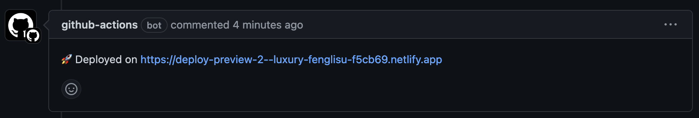

# Documentation for workflow templates

## Pull Request Deploy Previews

Note: instructions below were written for the Quarto Deploy Preview workflow template but apply the same to the Pkgdown Deploy Preview workflow template.

Files:
- deploy-preview.yml/deploy-preview-pkgdown.yml
- deploy-preview.properties.json/deploy-preview-pkgdown.properties.json

Pre-requisites

- Install Netlify cli tool
	- macos: use homebrew: `homebrew install netlify-cli`
	- other platforms: see <https://docs.netlify.com/cli/get-started/>
- Install GitHub cli tool
	- see <https://cli.github.com/>

1. Netlify (CLI & Browser)
	- inside your project
	- login to Netlify: `netlify login`
	- Initialize your project with Netlify: `netlify init`
	- Remove git integration so site only builds when we tell it to
		- Run `netlify open` to go the Netlify page for the app
		- Site Configuration > Build & Deploy > Unlink github repo
	- While in the Netlify UI, get the site ID and save for Step 3:
		- Site Configuration > General > Site details > Site information, copy the value for Site ID
	- Obtain a personal access token in the Netlify UI <https://docs.netlify.com/cli/get-started/#obtain-a-token-in-the-netlify-ui>

2. In your GitHub repository (CLI)
	- Add the Netlify token as an env var as `NETLIFY_AUTH_TOKEN` to your GitHub repo
		- Run `gh secret set NETLIFY_AUTH_TOKEN -a actions -b <your token>`

3. Setup the workflow file (Browser)
	- Go to the actions tab of your repo
	- Click "New workflow"
	- Click "Quarto Deploy Preview" (see [starter workflows](https://docs.github.com/en/actions/using-workflows/creating-starter-workflows-for-your-organization) for reference)
	- In the file that opens up set the NETLIFY_SITE_ID to the Site ID in the Configuration page of your Netlify app
	- Commit the GH action file

You're done!

Upon the next pull request, you should see a ping back from Netlify:

Notes:
	- The same link to the deploy preview will be used each time you get a deploy preview
	- The GitHub Action that runs as a result of this workflow template cleans up (deletes) old bot comments so that you don't have a bunch of bot comments with the same link - leaving the latest bot comment in place
	- Permissions changes
		- workflow permissions need to be changed for this to work in GitHub repos, but they are set correctly for all WILDS repos by default
	- Why? Good question! You can simply link a GitHub repository to Netlify, but that integration doesn't allow .....
